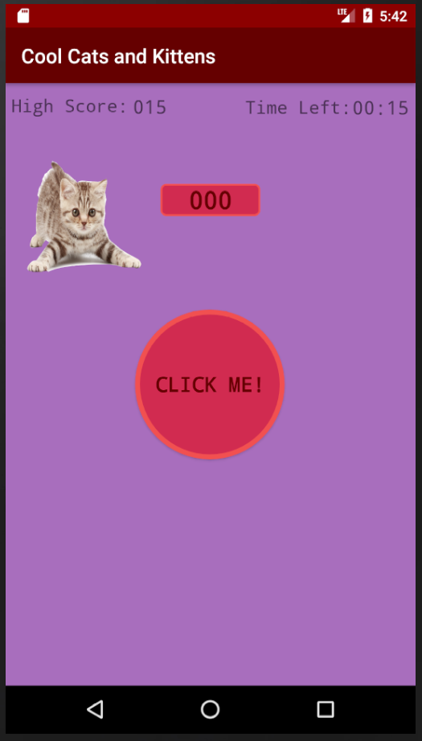

# <div style="text-align: center">CS 3013 Final Project </div>
#### <div style="text-align: center">By Nick Gagliardi & Andy Johnson </div>

### Assignment Guide Lines:
This assignment is open-ended. You are to use your creativity to develop an Android App while sticking to the stated guidelines. Here are the Guidelines for the assignment.
1. The App must be original to you. How the App works and what it looks like must not be one found in any tutorials or elsewhere.
2. The App must make use of one or more sensors.
3. The App must do at least two of the following:
    - Use persitance
    - Get information from a server
    - Interact with another App on this device using *intents*
    - Interact with another device using **Bluetooth** or some other means.
    - Something else like these. Get an OK from me **BEFORE** you begin.
4. The app must interact with the user
5. Something else that you think fits into the spirit of guidelines 2 and 3 to replace one or more of these guidelines. You must get permission for this **before** you begin.

---

### Grading Criteria:
As this is an open-ended project, the grading si somewhat open-ended also. The Following will be taken into consideration:
- How complicated the app was to develop.
- The range of functionality included.
- The overall quality (basically, does it look good?).
- If it is a game, is it fun?
- The Quality of the writeup. Does it clearly tell me what your App does and how to interact with it.
- The quality of the presenation

The Above is not a complete list - it is intended to give you an idea of what I am looking for. Please don't hesitate to ask me questions about your project.

---

### Application Description:
During these trying times, everyone is looking to get their mind off the quarantine. So we decided to design a simple app that would allow someone to turn their brain off...

1. When first starting the app you will see the following screen:

2. As the user clicks the center button `CLICK ME!` the Users score will increase:

3. The game will also remember your highest score:

4. Also as the user clicks the center button `CLICK ME!` the 3 shapes move around the screen:


5. At different stages in the game funny or silly messages popup, once again to facilitate the empytying of your mind:


6. At different stages of the game the user will be attacked by cats, the user has to slap (i.e. swipe) them away.

7. Finally the game ends when the user runs out of time. At which point the phone will shake and make a loud beeping sound to wake you from your mindless state:


---

### Code Details:
#### MainActivity.kt
- This is the main .kt file of the program and contains the following functions:
    - **onCreate**
    - Description:
        - coming soon!
    ```kotlin
    override fun onCreate(savedInstanceState: Bundle?) {
        super.onCreate(savedInstanceState)
        setContentView(R.layout.activity_main)
        cb = ChalkBoard(this)
        cb2 = ChalkBoard(this)
        cb3 = ChalkBoard(this)
        backgroundLayout.addView(cb)
        backgroundLayout.addView(cb2)
        backgroundLayout.addView(cb3)

        val tvHighScore: TextView = findViewById(R.id.high_score_number)
        val btnClickMe: Button = findViewById(R.id.click_me_btn)
        val scoreTextView: TextView = findViewById(R.id.scoreText)

        tvHighScore.text = getHighScore().toString().padStart(3, '0')

        mTimer = Timer(30000)
        setUpSensor()

        //set up stress button click listener
        btnClickMe.setOnClickListener{
            cb!!.wander()
            cb2!!.wander()
            cb3!!.wander()
            vibrate(10)
            if(firstPress){
                mTimer!!.start()
                firstPress = false
            }
            playSound()
            scoreCount += 1
            scoreTextView.text = scoreCount.toString().padStart(3, '0')
            checkScore(scoreCount)
            if (scoreCount > getHighScore()){
                setHighScore(scoreCount)
                tvHighScore.text = scoreCount.toString().padStart(3, '0')
            }
        }
    }
    ```

    - **vibrate**
    - Description:
        - coming soon!
    ```kotlin
    private fun vibrate(duration: Int){
        val vibrator = getSystemService(Context.VIBRATOR_SERVICE) as Vibrator
        if (Build.VERSION.SDK_INT >= 26) {
            vibrator.vibrate(VibrationEffect.createOneShot(duration.toLong(),
            VibrationEffect.DEFAULT_AMPLITUDE))
        } else {
            vibrator.vibrate(duration.toLong())
        }
    }
    ```
    - **setUpSensor**
    - Description:
        - coming soon!
    ```kotlin
    private fun setUpSensor(){
        mSensorManager = getSystemService(Context.SENSOR_SERVICE) as SensorManager
        mSensorManager.registerListener(
            this,
            mSensorManager.getDefaultSensor(Sensor.TYPE_ACCELEROMETER),
            SensorManager.SENSOR_DELAY_NORMAL
        )
        if (mSensorManager.getDefaultSensor(Sensor.TYPE_ACCELEROMETER) != null) {
            // Success!
            Log.v("success","yes")
        } else {
            // Failure!
            Log.v("Failure","No sensor found")
        }
    }
    ```

    - **playSound**
    - Description:
        - coming soon!
    ```kotlin
    private fun playSound(){
        val btnClick :View = findViewById(R.id.click_me_btn)
        val xyPoint : Point? = getCenterPointOfView(btnClick)
        if (xyPoint != null) {
            Log.v("XY","x: ${xyPoint.x}    y: ${xyPoint.y}")
        }
        soundCount += 1
        mediaPlayer = MediaPlayer.create(this, R.raw.alien_click)
        try{
            if(mediaPlayer!!.isPlaying) {
                mediaPlayer!!.stop()
                mediaPlayer!!.release()
                playSound()
            }
        }catch(e: Exception){
            e.printStackTrace()
        }
        mediaPlayer?.start()
        mediaPlayer!!.setOnCompletionListener {
            it.release()
        }
    }
    ```

    - **setHighScore**
    - Description:
        - coming soon!
    ```kotlin
    private fun setHighScore(score: Int){
        val prefs = getSharedPreferences("puffNstuff", Context.MODE_PRIVATE)
        val editor = prefs.edit()
        editor.putInt("highScore", score)
        editor.apply()
    }
    ```

    - **getHighScore**
    - Description:
        - coming soon!
    ```kotlin
     private fun getHighScore(): Int {
        val prefs = getSharedPreferences("puffNstuff", Context.MODE_PRIVATE)
        return prefs.getInt("highScore", 0)
    }
    ```

    - **checkScrore**
    - Description:
        - coming soon!
    ```kotlin
    private fun checkScore(score: Int){

        when(score){
            10 -> {
                Toast.makeText(this@MainActivity, "Guess what!?", Toast.LENGTH_SHORT).show()
                if(!arrayofAwards[0]) {
                    arrayofAwards[0] = true
                    editTimer(mTimer, 10)
                }
            }
            25 ->{
                Toast.makeText(this@MainActivity, "Chicken Butt!!", Toast.LENGTH_SHORT).show()
                if(!arrayofAwards[1]) {
                    arrayofAwards[1] = true
                    editTimer(mTimer, 5)
                }
            }
            50 ->{
                Toast.makeText(this@MainActivity, "Wanna hear a joke?", Toast.LENGTH_SHORT).show()
                if(!arrayofAwards[2]) {
                    arrayofAwards[2] = true
                    editTimer(mTimer, 5)
                }
            }
            100 ->{
                Toast.makeText(this@MainActivity, "Your LIFE!!!", Toast.LENGTH_SHORT).show()
                if(!arrayofAwards[3]) {
                    arrayofAwards[3] = true
                    editTimer(mTimer, 5)
                }
            }
            20 ->{
                if(!arrayofAwards[3]) {
                    arrayofAwards[3] = true
                    editTimer(mTimer, -5)
                }
            }
            150 ->{
                Toast.makeText(this@MainActivity, "You trying to go to the PARK?!?", Toast.LENGTH_SHORT).show()
                if(!arrayofAwards[4]) {
                    arrayofAwards[4] = true
                    editTimer(mTimer, 5)
                }
            }
            200 ->{
                Toast.makeText(this@MainActivity, "What about the strip club?!", Toast.LENGTH_SHORT).show()
                if(!arrayofAwards[5]) {
                    arrayofAwards[5] = true
                    editTimer(mTimer, 10)
                }
            }
            400 ->{
                Toast.makeText(this@MainActivity, "You like toast?", Toast.LENGTH_SHORT).show()
                if(!arrayofAwards[6]) {
                    arrayofAwards[6] = true
                    editTimer(mTimer, 5)
                }
            }
            800 ->{
                Toast.makeText(this@MainActivity, "Cinnamon Rolls?", Toast.LENGTH_SHORT).show()
                if(!arrayofAwards[7]) {
                    arrayofAwards[7] = true
                    editTimer(mTimer, 5)
                }
            }
            1000 ->{
                Toast.makeText(this@MainActivity, "Pootie Tang?", Toast.LENGTH_SHORT).show()
                if(!arrayofAwards[8]) {
                    arrayofAwards[8] = true
                    editTimer(mTimer, 5)
                }
            }
            1500 ->{
                Toast.makeText(this@MainActivity, "Sa da tay, ma damies, sa da tay!", Toast.LENGTH_SHORT).show()
                if(!arrayofAwards[9]) {
                    arrayofAwards[9] = true
                    editTimer(mTimer, 5)
                }
            }
        }
    }
    ```

    - **onFinish**
    - Description:
        - coming soon!
    ```kotlin
    override fun onFinish() {
            try {
                val notification: Uri =
                    RingtoneManager.getDefaultUri(RingtoneManager.TYPE_NOTIFICATION)
                val r =
                    RingtoneManager.getRingtone(applicationContext, notification)
                r.play()
                vibrate(3000)
                mTimer?.cancel()
            } catch (e: Exception) {
                e.printStackTrace()
            }
        }
    ```

    - **editTimer**
    - Description:
        - coming soon!
    ```kotlin
    private fun editTimer(prevTimer: Timer?, addTime: Int){
        if(prevTimer != null){
            val millis = prevTimer.millisUntilFinished + TimeUnit.SECONDS.toMillis(addTime.toLong())
            Log.v("Timer", "millis: $millis")
            prevTimer.cancel()
            mTimer = Timer(millis)
            mTimer!!.start()
        }
    }
    ```

    - **startTimer**
    - Description:
        - coming soon!
    ```kotlin
    private fun startTimer(){
        mTimer = Timer(30000)
        mTimer!!.start()
    }
    ```

    - **timString**
    - Description:
        - coming soon!
    ```kotlin
    private fun timeString(millisUntilFinished:Long):String{
        val minutes = TimeUnit.MILLISECONDS.toMinutes(millisUntilFinished)
        val seconds = TimeUnit.MILLISECONDS.toSeconds(millisUntilFinished) - TimeUnit.MINUTES.toSeconds(minutes)
                       //round seconds
        // Format the string
        return String.format(
            Locale.getDefault(),
            "%02d:%02d",
            minutes, seconds
        )
    }
    ```

    - **onSensorChanged**
    - Description:
        - coming soon!
    ```kotlin
    override fun onSensorChanged(event: SensorEvent?) {
        val x = event!!.values[0]
        val y = event.values[1]
        val z = event.values[2]

        mAccelLast = mAccelCurrent
        mAccelCurrent = sqrt((x * x + y * y + z * z).toDouble()).toFloat()
        val delta = mAccelCurrent - mAccelLast
        mAccel = mAccel * 0.9f + delta // perform low-cut filter
        if(mAccel > 25){
            if(firstPress){
                return
            }
            else {
                if(scoreCount - 5 >= 0 && scoreCanChange) {
                    editTimer(mTimer, 15)
                    Toast.makeText(this@MainActivity, "Added some Time Bitch!", Toast.LENGTH_SHORT)
                        .show()
                    scoreCount -= 5
                    scoreText.text = scoreCount.toString().padStart(3, '0')
                    scoreCanChange = false
                    Handler().postDelayed({
                        scoreCanChange = true
                    }, 5000)
                }
            }
        }
    }
    ```

    - **getCenterPointOfView**
    - Description:
        - coming soon!
    ```kotlin
    private fun getCenterPointOfView(view: View): Point? {
        val location = IntArray(2)
        view.getLocationOnScreen(location)
        val x = location[0] + view.width / 2
        val y = location[1] + view.height / 2
        return Point(x, y)
    }
    ```

